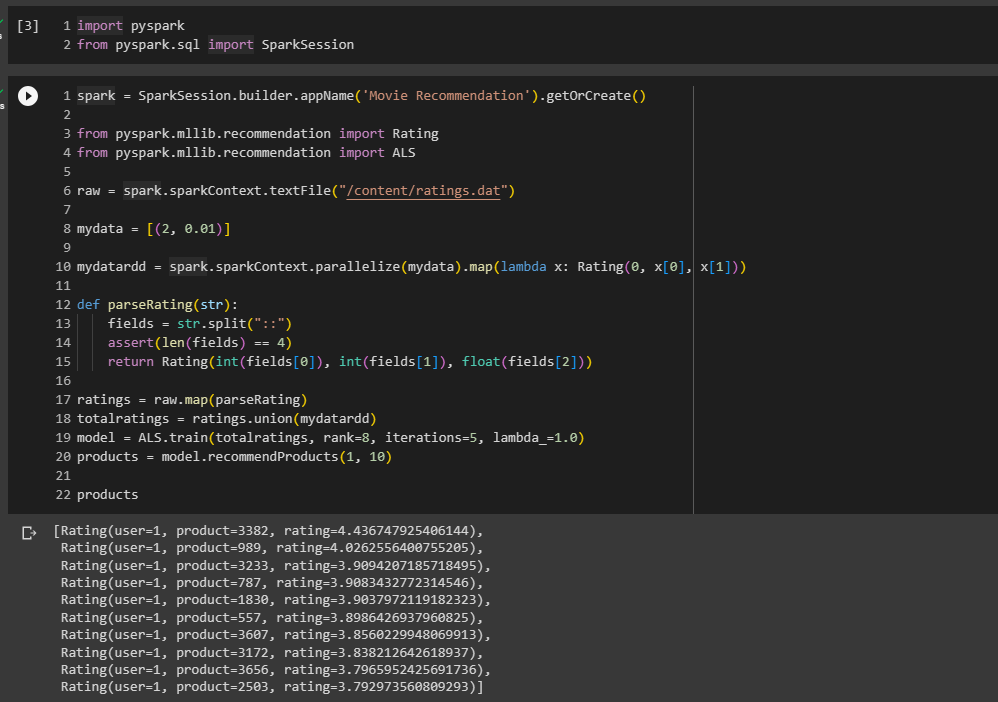
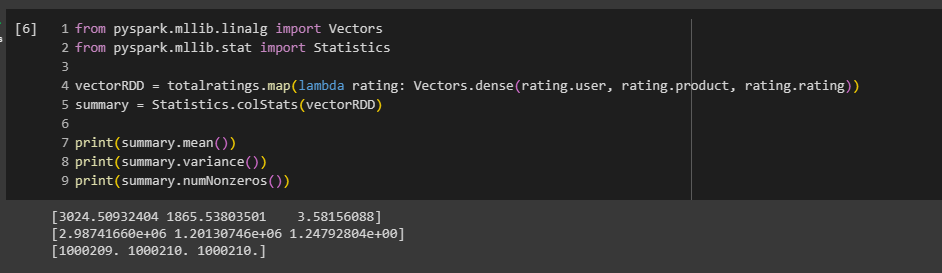
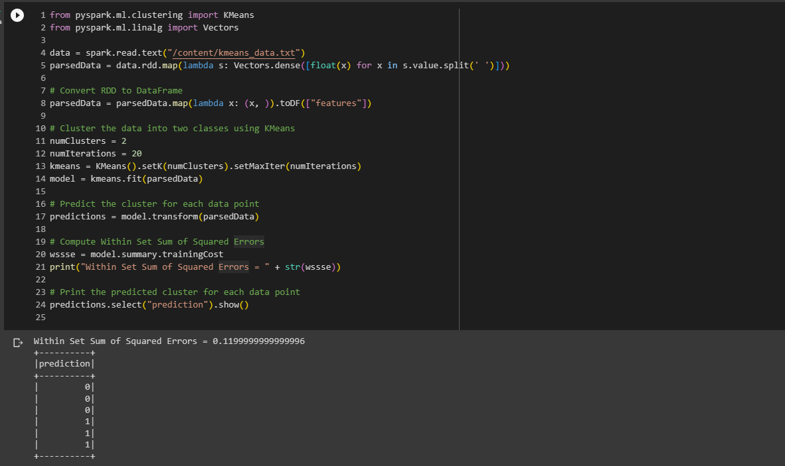
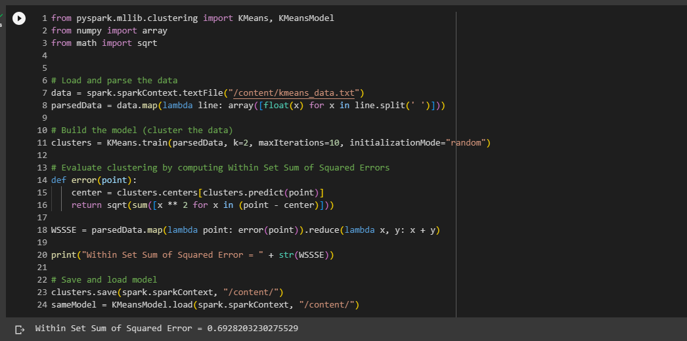
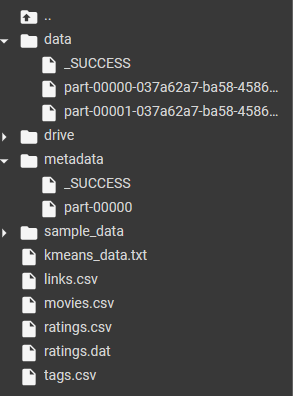

## Nama      : Pranata Dito Fitriyansyah
## Kelas     : TI - 3C
## No. Absen : 16

BIG DATA - Machine Learning

## Hasil

## Slide 30

  Mount google drive untuk akses dataset / file, kemudian import pyspark, dan buat SparkSession baru.
      kemudian import library pyspark.ml, dan pyspark.sql. 
        

  Kemudian read file <code>ratings.dat</code> pada google drive. kemudian lakukan RDD mapping dan Membuat model rekomendasi menggunakan ALS pada training data yang         telah dibuat sebelumnya.
        

   output :
        

## Slide 48 dan 49

 Load textFile <code>Ratings.dat</code> kemudian parallelize variable myData dan mapping file yg telah di load. Kemudian train totalRatings menggunakan metode ALS untuk mendapatkan rekomendasi produk. 
  
  
 Menampilkan statistik summary mulai dari rata", varian, dll dari vectorRdd rating yang telah di proses sebelumnya
        
  

## Slide 52

Import library ml KMeans dan Vectors. kemudian load kmeans_data.txt . Selanjutnya mapping dataset dan konversi menjadi dari RDD menjadi DataFrame dan memasukkan variable parsedData pada method kmeans.fit 
kemudian Menampilkan summary dari training cost dan prediksi cluster tiap data. 
   

## Slide 53 - 54
Import library Kmeans, Numpy, dan Math. Kemudian membaca file kmeans_data.txt setelah itu melakukan mapping dengan patokan tiap data dipisahkan menggunakan delimiter spasi .
kemudian training data dengan Kmeans. dengan jumlah kluster 2 dan maksimal iterasi 10 dan Menghitung WSSE dari parsedData kemudian melakukan saving model pada folder yang telah disesuaikan
  
  
Hasil pada folder :

   
