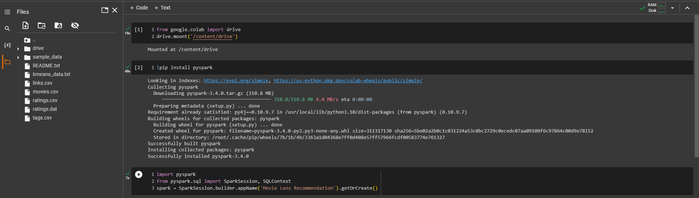
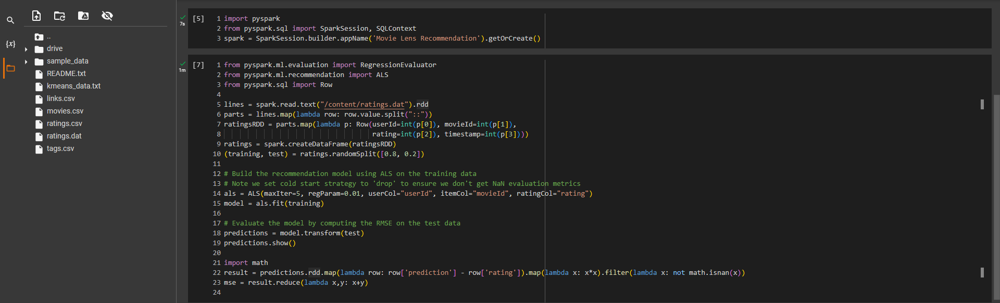
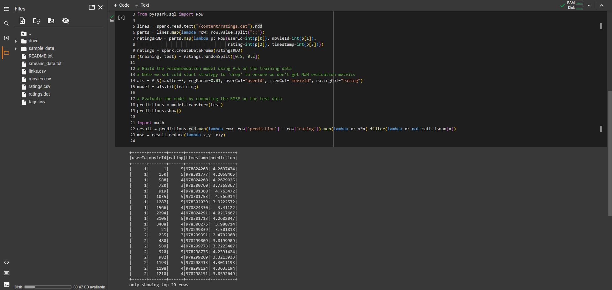

## Nama      : Pranata Dito Fitriyansyah
## Kelas     : TI - 3C
## No. Absen : 16

BIG DATA - Machine Learning

## Hasil

## Slide 30

  mount google drive untuk akses dataset / file, kemudian import pyspark, dan buat SparkSession baru.
      kemudian import library pyspark.ml, dan pyspark.sql. Kemudian read file <code>ratings.dat</code> pada google drive. kemudian lakukan RDD mapping.
        

   Membuat model rekomendasi menggunakan ALS pada training data yang telah dibuat sebelumnya.
        

   output :
        

